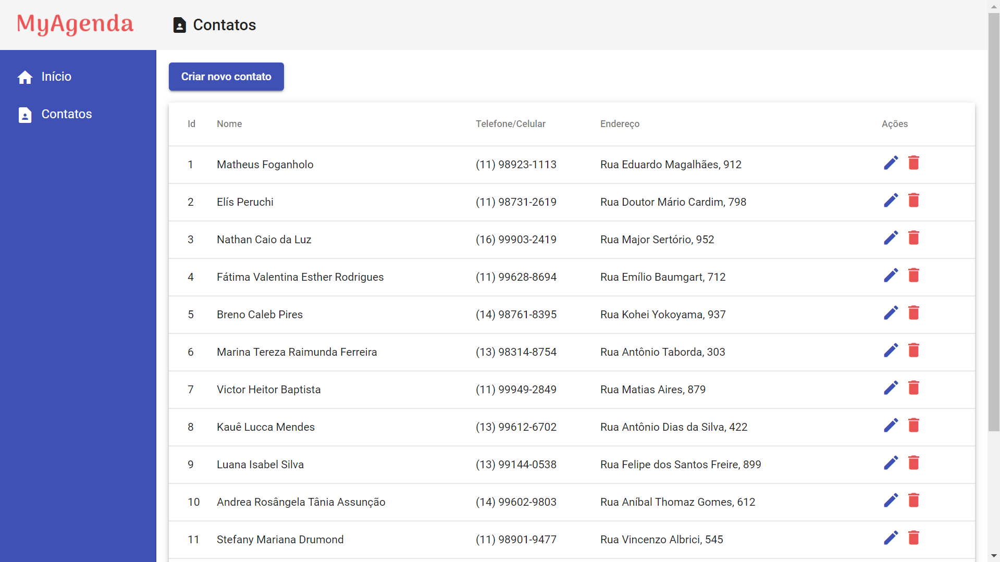

# angular-agenda 📞

This is a small and basic project, where a simple crud (create, read, update, delete) using Angular was created. It is a single page application with a simple backend that stores the contact's name, phone and address.<br/>



To use and test the application, you must initially clone / download it. <br/>
After that you must open the terminal in the application's root folder and navigate to the back-end by typing:
```
cd backend
```
After that, you will have to install the project's dependencies, using the following command:
```
npm install
```
And now, start the backend with:
```
npm start
```
Now, with another instance of the terminal, we will go to the "front-end" folder. If it is in the "back-end" folder, type:
```
cd ../front-end
```
And install the front-end dependencies.
```
npm install
```
And now just start the front-end and test the application!
```
ng serve --open
```
Hope you like it! Any criticism or suggestion is welcome!<br/>
<hr>

## Português/Portuguese (PT-BR)
Este é um pequeno e básico projeto, onde foi criado um simples crud (create, read, update, delete) usando Angular. É uma aplicação de uma única página com um back-end simples que armazena o nome, o telefone e o endereço do contato.<br/>
Para utilizar e testar a aplicação, você deve inicialmente cloná-la/baixá-la.<br/>
Após isso você deve abrir o terminal na pasta raiz da aplicação e navegar até o back-end digitando:

```
cd back-end
```
Após isso, você terá que instalar as dependências do projeto, utilizando o seguinte comando:
```
npm install
```
E agora, iniciar o back-end com:
```
npm start
```
Agora, com outra instância do terminal, iremos para a pasta "front-end". Caso esteja na pasta "back-end" digite:
```
cd ../front-end
```
E instalar as dependências de front-end.
```
npm install
```
E agora basta iniciar o front-end e testar a aplicação!
```
ng serve --open
```
Espero que gostem! Qualquer crítica ou sugestão é bem vinda!